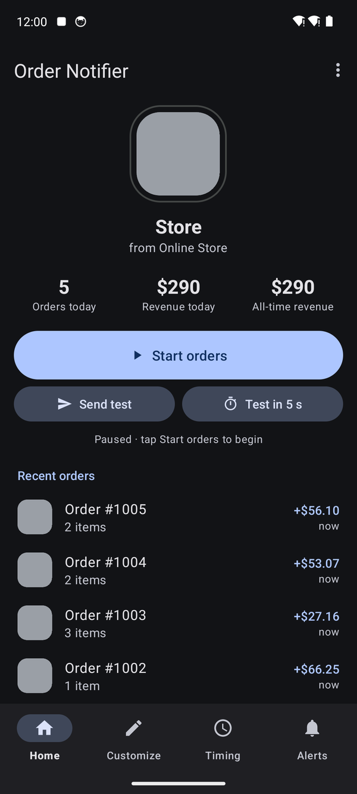
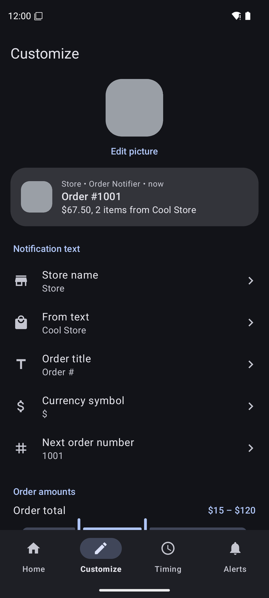
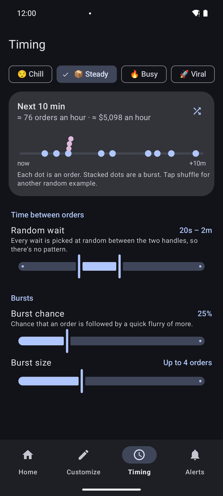
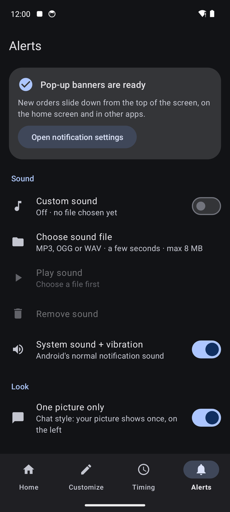

# Order Notifier

Personal motivation app for Android (Pixel). Posts random, local-only "new order"
notifications to *your own phone*. Nothing is sent anywhere; it only works on the
device it's installed on.

| Home | Customize | Timing | Alerts |
| --- | --- | --- | --- |
|  |  |  |  |

## What's in it

- **Home**: your store's picture with a "live" ring while orders are on, today's orders and
  revenue, a big Start/Stop button, test buttons and a feed of recent orders.
- **Customize**: picture, store name, the "from …" text, order title, currency and next order
  number. Each opens its own editor with a live preview. Order totals and items per order.
- **Timing**: one-tap presets (Chill, Steady, Busy, Viral), random wait range, burst chance and
  size, plus an example timeline and an orders-per-hour estimate.
- **Alerts**: checks that pop-up banners can show, custom notification sound (silenced by Do Not
  Disturb), system sound, chat style (picture shown once) and keep-awake.
- Blank slate defaults: name "Store", "from Online Store", grey picture, no branding.

## Install

GitHub → Actions → latest **Build APK** run → download `app-debug` → unzip → install the APK
on your phone (allow "install unknown apps"). Or open the project in Android Studio and Run.

The default texts live in `Settings.kt` (`DEFAULT_STORE_NAME`, `DEFAULT_FROM_TEXT`, `DEFAULT_TITLE_PREFIX`).

## Screenshots

`docs/screenshots` is refreshed automatically by the **UI screenshots** workflow, which runs the app
on an Android 14 emulator (`scripts/ui-screenshots.sh`, `scripts/ui-flow.sh`).
